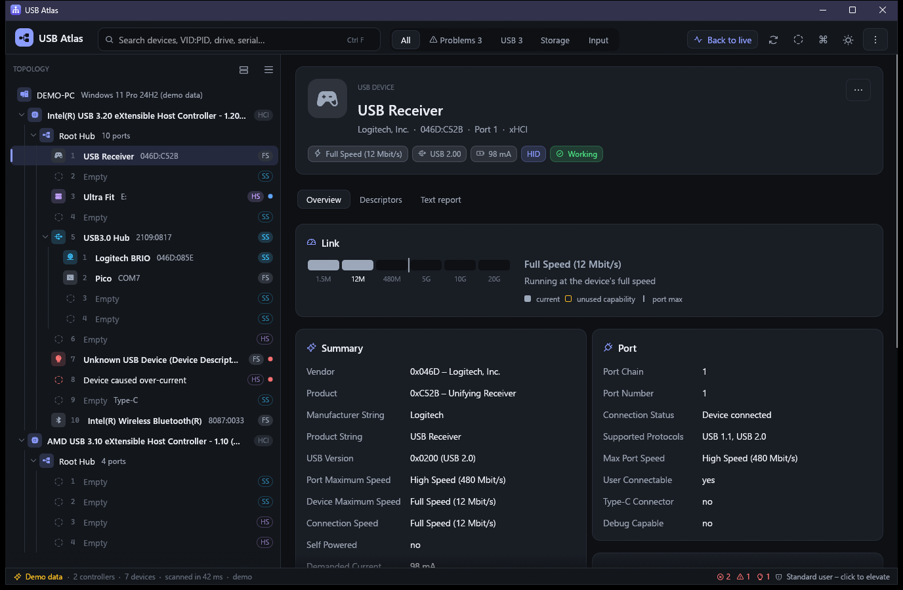

# USB Atlas

A modern USB topology explorer for Windows, written in Rust. It covers the
feature set of Uwe Sieber's *USB Device Tree Viewer* (USBTreeView), wrapped in
a fast, interactive UI and extended with diagnostics, snapshots and
reporting. The name is a working title and is defined in one place:
`APP_NAME` in `src/app/mod.rs`.



## Features

**Topology (USBTreeView parity)**
- Host controllers → root hubs → hubs → ports → devices, including empty ports,
  USB 3 companion ports (highlighted together), Type-C and internal ports
- Optional Windows child devices (composite functions, disks, COM, HID …)
  with drive letters and COM port names shown inline
- Connection status per port (over-current, failed enumeration …), speed, address, pipes
- Full descriptor decoding: device, configuration, IAD, interface, endpoint,
  SuperSpeed(Plus) companions, HID, Audio, Video (UVC), CDC, DFU, OTG, BOS and
  device capabilities (USB 2.0 ext, SuperSpeed, SS+, Container ID, WebUSB,
  MS OS 2.0, Billboard), hub descriptors, device qualifier, all string
  descriptors in all languages
- Device Manager information: IDs, driver (provider/version/date/INF),
  service, class, location paths, container ID, filters, problem codes
- Host controller PCI IDs and flavor via `IOCTL_USB_USER_REQUEST`
- Actions: safely remove (with veto reason), restart device, enable / disable,
  cycle port, open device properties, open drive, restart as administrator
- Auto-refresh on device change (`CM_Register_Notification`), arrival glow
  and removal "ghost" rows, jump to new devices
- Text reports (`--report`), command-line export, copy per node / whole tree

**Beyond USBTreeView**
- **Insights**: explains *why* a device is slow (SuperSpeed device on a USB 2
  cable or port), power budget overruns, problem codes in plain English,
  descriptor spec violations, BadUSB-style warnings (keyboard + storage/network)
- **Interactive hex view**: hover a decoded field to highlight its bytes, or
  hover a byte to see which field it belongs to
- **Link ladder** showing actual speed vs. device capability vs. port maximum
- **Port map** for every hub, with a bus-power budget bar
- **Dashboard** for the whole machine (device counts, speed distribution, pins)
- **Command palette** (Ctrl+K): fuzzy-jump to any device or run any command
- **Search and quick filters** (Problems, USB 3, Storage, Input) with match highlighting
- **Activity timeline** of arrivals, removals and new problems, with timestamps
- **Snapshots**: save / open JSON, drag-and-drop to open, compare a snapshot
  against the live system to see what changed
- **HTML report** export (self-contained, light/dark aware)
- **Nicknames** for devices (stored per VID:PID:serial) and pinned favorites
- Light / dark / system theme with five accent colors, compact mode,
  always-on-top, keyboard-driven navigation throughout

## Keyboard

| Keys | Action |
|---|---|
| F5 / Ctrl+R | Refresh |
| Ctrl+K / Ctrl+P | Command palette |
| Ctrl+F | Search |
| ↑ ↓ ← → Home End PgUp PgDn | Navigate the tree |
| F2 | Rename (nickname) |
| Ctrl+C | Copy selected node's report |
| Ctrl+Shift+C | Copy full report |
| Ctrl+S / Ctrl+O | Save / open snapshot |
| Ctrl+E | Export HTML report |
| Ctrl+J | Activity & insights panel |
| Ctrl+Shift+L | Toggle light / dark |
| Ctrl+, | Settings |

## Command line

```
usbtree [snapshot.json]      open the GUI (optionally on a saved snapshot)
usbtree --demo               GUI with built-in demo data
usbtree --report [file]      text report (stdout if no file)
usbtree --html <file>        HTML report
usbtree --json [file]        JSON snapshot
usbtree --no-hex             omit hex dumps from reports
```

## Building

Requires Rust 1.92+ with the MSVC toolchain on Windows.

```
cargo build --release       # target/release/usbtree.exe (single file, no installer)
cargo test                  # descriptor decoding, tree, diff, insights, reports
```

Most information is available as a standard user. Restart, enable/disable and
cycle port need administrator rights ("Restart as administrator" in the menu).

## Project layout

| Path | Purpose |
|---|---|
| `src/descriptors/` | Pure, tested USB descriptor decoders (field offsets for the hex view) |
| `src/model.rs` | Serializable topology model = snapshot file format |
| `src/platform/win/` | Win32: enumeration (usbview algorithm), devnodes, actions, notifications |
| `src/tree.rs` | Flattening into display nodes with stable ids, snapshot diffing |
| `src/insights.rs` | Diagnostics heuristics |
| `src/details.rs` | Detail sections shared by the UI, text and HTML reports |
| `src/export.rs` | HTML report |
| `src/app/` | egui UI: theme, tree, detail pane, hex view, palette, toasts |

## Credits

- Inspired by [USB Device Tree Viewer](https://www.uwe-sieber.de/usbtreeview_e.html) by Uwe Sieber
  and Microsoft's `usbview` sample.
- Vendor/product names from the [linux-usb.org usb.ids](http://www.linux-usb.org/usb.ids)
  database (GPL-2.0-or-later or BSD-3-Clause), embedded at build time.
- Icons: [Phosphor](https://phosphoricons.com) via `egui-phosphor`.
